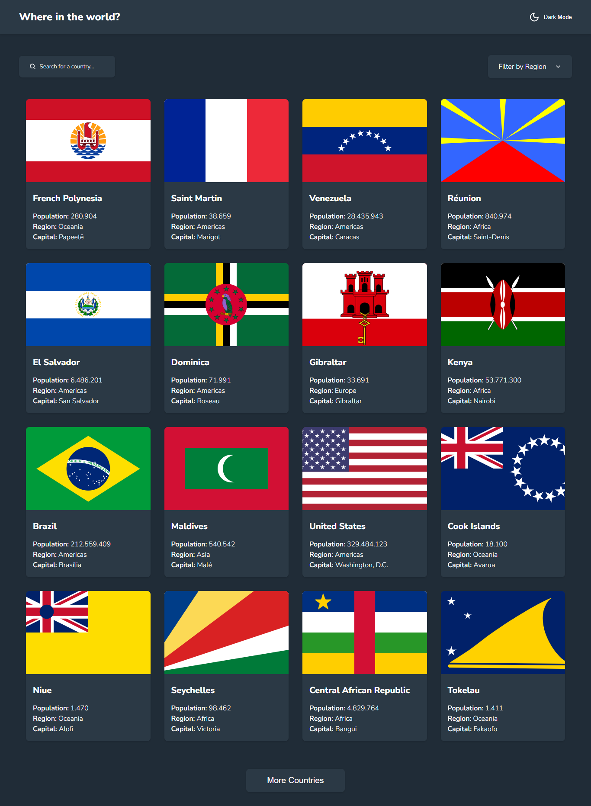

# <center>:file_cabinet: Projeto React.js 01</center>

<br>

## Descrição

Um aplicativo para fazer uma integração com o **[REST Countries API](https://restcountries.com)** para extrair dados dos países e exibi-los na aplicação.

<br>

## Table of contents

- [Descrição](#descrição)

- [Frontend Mentor](#frontend-mentor)

- [Screenshot](#screenshot)

- [Links](#links)

- [Funcionalidades](#funcionalidades)

  - [funcionalidades principais](#1-funcionalidades-principais)
  - [funcionalidades extras](#2-funcionalidades-extras)

- [Tecnologias Utilizadas](#tecnologias-utilizadas)

  - [bibliotecas](#1-bibliotecas)
  - [outras](#2-outras)

- [Rodando O Projeto](#rodando-o-projeto)

- [Extensões Do VS Code](#extensões-do-vs-code)

- [Estrutura De Pastas](#estrutura-de-pastas)

- [Colaboradores](#colaboradores)

- [Git Flow](#git-flow)

  - [Branches](#1-branches)
  - [pull requests](#2-pull-requests)
  - [commits](#3-commits)

- [Status Do Projeto](#status-do-projeto)

<br>

## Frontend Mentor

Esta é uma solução para o [desafio da API REST de países com alternância de tema de cores no Frontend Mentor](https://www.frontendmentor.io/challenges/rest-countries-api-with-color-theme-switcher-5cacc469fec04111f7b848ca). Os desafios do Frontend Mentor ajudam você a melhorar suas habilidades de codificação através da construção de projetos realistas.

<br>

## Screenshot



<br>

## Links

- URL no Frontend Mentor: [Add solution URL here](https://your-solution-url.com)
- URL do site em produção: [Add live site URL here](https://your-live-site-url.com)

<br>

## Funcionalidades

O usuários devem ser capazes de:

### 1. funcionalidades principais

- [x] Ver todos os países da API na página inicial.

- [x] Pesquisar um país usando um campo `input`.

- [x] Filtrar países por região.

- [x] Clicar em um país para ver informações mais detalhadas em uma página separada.

- [x] Clicar nos países de fronteira na página de detalhes.

- [x] Alternar o esquema de cores entre o modo claro e escuro.

### 2. funcionalidades extras

- [x] Botão para ver mais países, limitando 16 países na página home.

<br>

## Tecnologias Utilizadas

### 1. bibliotecas

- [React.js](https://react.dev/learn/ "documentação do react.js")

- [React Router Dom](https://reactrouter.com/en/main/ "documentação do react router dom")

- [Axios](https://axios-http.com/ptbr/docs/intro/ "documentação do axios")

- [React Icons](https://react-icons.github.io/react-icons/ "documentação do react icons")

- [React Loading](https://www.npmjs.com/package/react-loading/ "Package do react loading no npm")

### 2. outras

- [Sass](https://sass-lang.com/documentation/ "documentação do sass")

- [Vite](https://vitejs.dev/guide/ "documentação do vite")

- [Storybook](https://storybook.js.org/)

<br>

## Rodando O Projeto

Para rodar o repositório na sua máquina, será necessário clonar o mesmo e dar os respectivos comandos para iniciar um servidor do projeto através do Vite:

```bash
npm install
```

```bash
npm run dev
```

<br>

## Extensões Do VS Code

Também é recomendado a instalação das seguintes extensões para a organização e padronização do projeto:

- [EditorConfig for VS Code](https://marketplace.visualstudio.com/items?itemName=EditorConfig.EditorConfig)

- [Prettier - Code formatter](https://marketplace.visualstudio.com/items?itemName=esbenp.prettier-vscode)

- [ESLint](https://marketplace.visualstudio.com/items?itemName=dbaeumer.vscode-eslint)

- [ES7+ React/Redux/React-Native snippets](https://marketplace.visualstudio.com/items?itemName=dsznajder.es7-react-js-snippets) *(opcional)*

- [Todo Tree](https://marketplace.visualstudio.com/items?itemName=Gruntfuggly.todo-tree) *(opcional)*

<br>

## Estrutura De Pastas

<br>

| Folder | Description |
| ---:   | --- |
| `assets/`     | Serve para armazenar imagens (imagens leves, se forem pesadas sempre prefira hospedar em uma CDN), ícones, etc. |
| `components/` | Componentes reutilizáveis da aplicação. Componentes que são unidades para sua aplicação, um button, um dropdown, um modal, etc. |
| `hooks/`      | Essa pasta é utilizada para armazenar hooks que são genéricos, têm interação com hooks do React (useState, useEffect) e normalmente reutilizáveis e qualquer projeto, exemplos: useScreenSize, useLocalStorage, useSessionStorage, useUserActive. |
| `layout/`     | Essa pasta é utilizada para os layouts. |
| `pages/`      | As pages são as páginas que usam vários componentes. É essa a página que o usuário vai ver. |
| `services/`   | Aqui ficam as configurações de HTTP clientes, normalmente utilizando axios. |
| `store/`      | Ficam as definições de state managers, context api, zustand, redux. |
| `utils/`      | Funções utilitárias como formatCurrency, formatPhone, convertTimezone, parsePhone (javascript puro). |

<br>

> Esta estrutura de pasta foi inspirada na estrutura de João Bibiano, que se encontra no seguinte repositório: <br> <https://github.com/joaobibiano/react-js-project-structure-lesson/blob/main/README.md> .

<br>

## Colaboradores

<table>
  <tr>
    <td align="center">
      <a href="https://github.com/eriveltondasilva">
        <br>
        <sub>
          <b>Erivelton Silva</b>
        </sub>
      </a>
    </td>
    <td align="center">
      <a href="http://github.com/Luiz-Honorato">
        <br>
        <sub>
          <b>Luiz Honorato</b>
        </sub>
      </a>
    </td>
    <td align="center">
      <a href="http://github.com/derciojds">
        <br>
        <sub>
          <b>Dercio JdS</b>
        </sub>
      </a>
    </td>
    <td align="center">
      <a href="http://github.com/Edlavio">
        <br>
        <sub>
          <b>Pedro Alberto</b>
        </sub>
      </a>
    </td>
    <td align="center">
      <a href="https://github.com/Manuel-AC-Ventura">
        <br>
        <sub>
          <b>Manuel Ventura</b>
        </sub>
      </a>
    </td>
    <td align="center">
      <a href="https://github.com/fxdias">
        <br>
        <sub>
          <b>Fernando Ximenes</b>
        </sub>
      </a>
    </td>
  </tr>
</table>

<br>

## Git Flow

### 1. branches

> main -» branch em produção

> dev -» branch para desenvolvimento

Branches locais devem seguir o padrão:
*<iniciais_do_colaborador/identificador_da_task/título_da_task>*

Exemplo:
> WA/TASK-130/Página_de_Detalhes

### 2. pull requests

Cada alteração deve ser feita a partir de PR's.
Devs devem fazer o checkout da `branch dev` e criar uma PR para a mesma (`branch dev`).

Após a PR ser aprovada, o criador da PR deverá fazer o merge (`squash and merge`) e deletar a sua branch.

### 3. commits

Ficou convencionado que não seguiremos padrão, apenas que os commits devem ser em português.

<br>

## Status Do Projeto

:rocket: Projeto finalizado

<br>
